# LeNet - First Convolutional Neural Network Ever

---

# LeNet-5 [LeCun et al., 1998]

#### Historical significance:
* **First successful CNN**  deployed at scale
* Used by US Postal Service  for **zip code recognition**
* Processed millions of checks!

#### Architecture:
* 2 Convolutional layers
* 2 Pooling (subsampling) layers
* 3 Fully-connected layers
* ~60,000 parameters

  <figure>
    
  </figure>   

#### Design choices:
* Conv filters: `5×5`, stride `1`
* Pooling: `2×2`, stride `2`
* Activation: tanh/sigmoid
  * ReLU wasn't yet discovered for deep nets

<small>LeCun et al., <a href="https://ieeexplore.ieee.org/document/726791">"Gradient-based learning applied to document recognition."</a> Proceedings of the IEEE (1998)</small>

<!--
**Presenter Notes:**

**Historical importance of LeNet:**

**The first CNN deployed at scale:**
- Yann LeCun, 1998
- Used by US Postal Service
- Read zip codes on envelopes
- Processed MILLIONS of checks!

**Architecture (simple by today's standards):**
- 2 conv layers (5×5 filters)
- 2 pooling layers (2×2 average pooling)
- 3 fully-connected layers
- ~60,000 parameters (tiny!)

**Design choices of the era:**
- Tanh/sigmoid activations (ReLU came later)
- Average pooling (max pooling became standard)
- Small by modern standards

**Key insight:** The architecture pattern (conv-pool-conv-pool-fc) became the template for all future CNNs.
-->

---

# Convolutional Neural Network (CNN)
### CNN is a sequence of convolutional layers, interspersed with activation functions
 
 
 

  <figure>

    

    <figcaption style="color:#b3b3b3ff; font-size: 11px; position: absolute;"> Image by
      <a href="http://cs231n.stanford.edu/slides/2016/winter1516_lecture7.pdf">Andrej Karpathy</a>
    </figcaption>
  </figure>   

<!--
**Presenter Notes:**

**CNN = stacking convolutional layers**

Key points from Karpathy's visualization:
- Input image goes through multiple conv layers
- Each layer extracts different features
- Spatial dimensions typically decrease
- Number of channels typically increases

**What each color represents:**
- Blue: input and conv layers
- Green: pooling layers
- Orange: fully-connected layers

**The pattern:**
Conv → ReLU → Conv → ReLU → Pool → ... → FC → Softmax
-->

---

# CNN Architecture
#### Common CNN architecture can be seen as:

```mermaid
flowchart LR
    subgraph Input
        A[Image]
    end
    
    subgraph ConvBlock1[Convolutional Block 1]
        B1[Conv] --> B2[ReLU]
        B2 --> B3[Conv]
        B3 --> B4[ReLU]
        B4 --> B5[MaxPool]
    end
    
    subgraph ConvBlock2[Convolutional Block 2]
        C1[Conv] --> C2[ReLU]
        C2 --> C3[Conv]
        C3 --> C4[ReLU]
        C4 --> C5[MaxPool]
    end
    
    subgraph Output
        D1[Flatten] --> D2[FC]
        D2 --> D3[ReLU]
        D3 --> D4[FC]
        D4 --> D5[Softmax]
    end
    
    A --> B1
    B5 -.-> C1
    C5 -.-> D1
```
 

 

#### with many convolutional blocks with at least 2 Conv layers in each block

<!--
**Presenter Notes:**

**Standard CNN architecture pattern:**

1. **Input**: Raw image (H × W × 3 for RGB)

2. **Convolutional blocks** (repeat N times):
   - Conv → ReLU (feature extraction)
   - Conv → ReLU (more features)
   - MaxPool (downsampling)
   - Channels increase: 3 → 64 → 128 → 256...
   - Spatial size decreases: 224 → 112 → 56 → 28...

3. **Output head**:
   - Flatten: 3D tensor → 1D vector
   - FC layers: classification logic
   - Softmax: probabilities

**Why multiple convs before pool?**
- More non-linearity before downsampling
- VGG insight: two 3×3 = one 5×5 receptive field, fewer params
-->

---

# 2D convolutional NN visualization on MNIST <a href="https://adamharley.com/nn_vis/cnn/2d.html">[link]</a>

<iframe src="https://adamharley.com/nn_vis/cnn/2d.html" width="1100" height="550" style="-webkit-transform:scale(0.8);-moz-transform-scale(0.8); position: relative; top: -65px; left: -120px"></iframe>

<!--
**Presenter Notes:**

**Interactive demo** - spend 2-3 minutes here:

1. Draw different digits and watch activations change
2. Point out:
   - First conv layer: edge-like patterns
   - Deeper layers: more abstract features
   - Final layer: class probabilities

**Ask students:**
- What happens when you draw a partial digit?
- Which neurons activate for "1" vs "7"?
- Can you see the spatial reduction through pooling?

**If internet is slow:** Have a backup screenshot.
-->

---
zoom: 0.9
---

# Receptive Field

### Definition
The **receptive field** of a neuron is the region in the input that influences that neuron's output.

 

### Key insights:
* **Deeper layers** have larger receptive fields
* With $3\times 3$ kernels:
  * Layer 1: $3\times 3$ receptive field
  * Layer 2: $5\times 5$ receptive field  
  * Layer 3: $7\times 7$ receptive field
* Pooling **increases receptive field quickly**

 

> *"The receptive field determines what context the network can use to make decisions."*
>  — Andrej Karpathy

### Biological inspiration
* Term comes from **neuroscience** ([Hubel & Wiesel](https://doi.org/10.1113/jphysiol.1962.sp006837), 1962)
* Visual cortex neurons respond to specific image regions
* Nobel Prize for discovering this!

 

### Why it matters:
* Small receptive field → local features (edges)
* Large receptive field → global features (objects)
* Network must be **deep enough** to "see" ("understand") entire objects

<!--
**Presenter Notes:**

**Receptive field is crucial to understand:**

**Definition:** The region in the INPUT that affects a particular output neuron.

**How it grows:**
- Layer 1 (3×3 kernel): 3×3 receptive field
- Layer 2: 5×5 (each 3×3 sees a 3×3 region)
- Layer 3: 7×7
- Pooling DOUBLES the receptive field!

**Why it matters:**
- To detect a face, network must "see" entire face
- If receptive field is too small, can only see edges
- This is why we need DEEP networks

**Biological connection:**
- Hubel & Wiesel discovered this in cats (1962)
- Won Nobel Prize for mapping visual cortex
- Neurons respond to specific visual field regions
-->

---

# What Do CNNs Learn?

### Layer 1: Edge detectors
* [Gabor-like filters](https://en.wikipedia.org/wiki/Gabor_filter)
* Oriented edges, color blobs
* Similar to what neuroscientists  found in [V1](https://en.wikipedia.org/wiki/Visual_cortex)

### Layer 2-3: Textures and patterns
* Combinations of edges
* Textures (stripes, dots, grids)
* Parts of objects

### Deeper layers: Object parts → Objects
* Eyes, wheels, faces
* Increasingly abstract concepts

### The remarkable discovery:
* Features are **learned**, not hand-crafted
* Networks trained on dataset learn:
  * Similar features to human visual cortex
  * Useful features for many tasks (transfer learning)

 

> *"The beauty of deep learning is that we don't design features anymore—we design architectures that learn features."*
>  — Andrej Karpathy

 

### Explore CNN interactively:
* [CNN Explainer](https://poloclub.github.io/cnn-explainer/)

<!--
**Presenter Notes:**

**What gets learned at each layer:**

**Layer 1:** Gabor-like filters
- Oriented edges at different angles
- Color blobs
- Almost identical to V1 neurons in visual cortex!

**Layers 2-3:** Textures
- Combinations of edges
- Stripes, grids, patterns
- Parts of objects

**Deeper layers:**
- Object parts (eyes, wheels)
- Eventually: whole objects
- Increasingly abstract

**The remarkable thing:**
- We didn't design these features!
- The network LEARNED them from data
- And they're useful for many tasks (transfer learning)

**Demo:** Show CNN Explainer if time permits.
-->

---

# CNN for Deep Learning
## Deep Learning = Learning Hierarchical Representations
### It's deep if it has more than one stage of non-linear feature transformation
 

  <figure>

    

    <figcaption style="color:#b3b3b3ff; font-size: 11px; position: absolute;"> Image by
      <a href="https://drive.google.com/file/d/18UFaOGNKKKO5TYnSxr2b8dryI-PgZQmC/view?usp=share_link">Yann LeCun</a>
    </figcaption>
  </figure>   

### Feature Hierarchy (LeCun):
1. **Layer 1**: Edges, colors, gradients
2. **Layer 2**: Textures, patterns
3. **Layer 3**: Parts (eyes, wheels)
4. **Layer 4+**: Objects, scenes

> *"Each layer transforms the representation to make certain aspects more explicit while suppressing irrelevant variation."*
> — Yann LeCun

<!--
**Presenter Notes:**

**Deep Learning = Hierarchical Feature Learning**

**LeCun's insight:**
- Each layer builds on the previous
- Simple features combine into complex ones
- Like building with LEGO bricks

**The hierarchy (from LeCun's visualization):**
1. Edges and colors
2. Textures and simple shapes
3. Object parts (eyes, wheels, windows)
4. Whole objects (faces, cars)

**Why "deep" matters:**
- More layers = more abstraction
- Each layer adds non-linearity
- Can represent increasingly complex functions

**Key quote:** "suppressing irrelevant variation"
- Lighting changes? Layer 1 handles it
- Rotation? Mid-layers handle it
- Different instances? Deep layers generalize
-->

---

# Convolutional Neural Network
## Putting it all together
 

  <figure>

    

    <figcaption style="color:#b3b3b3ff; font-size: 11px; position: absolute;"> Image by
      <a href="http://cs231n.stanford.edu/slides/2016/winter1516_lecture7.pdf">Andrej Karpathy</a>
    </figcaption>
  </figure>   

---

# Summary: Key Takeaways

### Core concepts:
1. **Convolution**: Local pattern detection with shared weights
2. **Pooling**: Downsampling + translation invariance
3. **Hierarchy**: Simple → Complex features
4. **Receptive field**: What the network "sees"

 

### The two key inductive biases:
* **Translation equivariance**: Same kernel everywhere
* **Locality**: Only nearby pixels matter

### Why CNNs work (Yann LeCun):
> *"CNNs exploit the compositionality of the visual world: complex patterns are built from simpler patterns."*

 

### Design principles:
* Start with proven architectures
* Small kernels ($3\times 3$) are often best
* Depth > Width (generally)
* Use BatchNorm
  * After Conv, before activation
* ReLU is the default activation

 

### 📚 Further reading: [d2l.ai Chapter 7-8](https://d2l.ai/chapter_convolutional-neural-networks/index.html)

<!--
**Presenter Notes:**

**Summary slide** - tie everything together:

**Four core concepts:**
1. **Convolution**: Slide kernel, detect patterns, share weights
2. **Pooling**: Downsample, gain translation invariance
3. **Hierarchy**: Build complex from simple
4. **Receptive field**: What context the network sees

**Two inductive biases:**
- Translation equivariance (same kernel everywhere)
- Locality (nearby pixels matter most)

**Practical advice for students:**
- Use proven architectures (don't reinvent the wheel)
- 3×3 kernels are the standard
- Deeper is usually better (with skip connections)
- BatchNorm helps training
- ReLU is the default

**Next lecture:** Modern architectures (ResNet, etc.)

**Further reading:** Point students to d2l.ai for implementation details.
-->